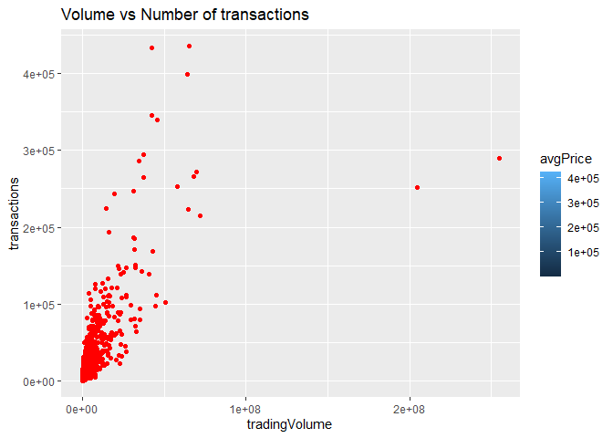
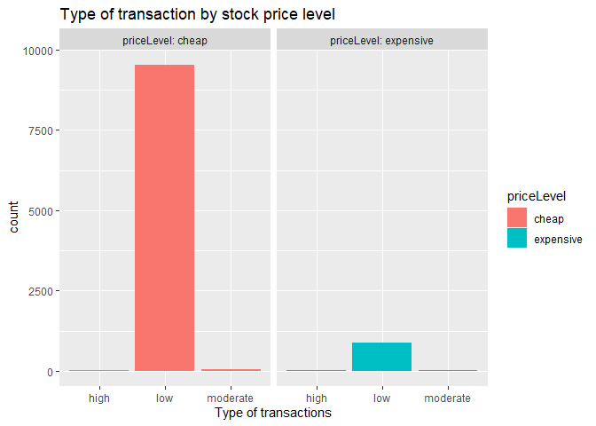
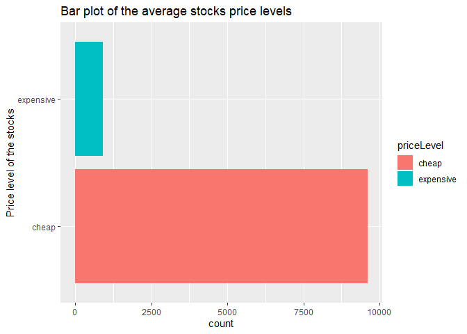
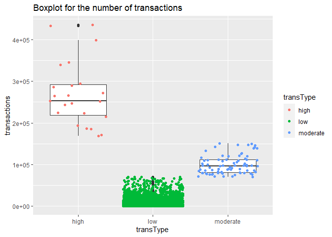
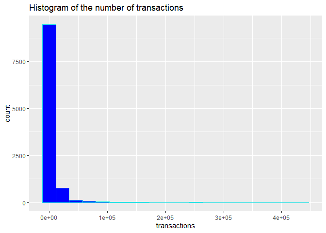

Project2
================
Ruben Sowah
2022-10-09

-   <a href="#goal" id="toc-goal">Goal</a>
-   <a href="#requirements" id="toc-requirements">Requirements</a>
-   <a href="#functions-to-interact-with-the-api"
    id="toc-functions-to-interact-with-the-api">Functions to Interact With
    the API</a>
-   <a href="#data-exploration" id="toc-data-exploration">Data
    Exploration</a>
-   <a href="#wrap-up" id="toc-wrap-up">Wrap-Up</a>

# Goal

Our goal is to create a vignette, which can be thought of as a long-form
guide or a small illustrative sketch. Vignettes are explanations of
concepts packages, etc with code and output inter-weaved.

In this project, we will create a vignette to contact the Financial data
API using functions to query, parse, and return well-structured data for
exploratory data analysis.

# Requirements

The following packages were used in the creation of this vignette:

-   tidyverse: a great package for data science and data manipulation
-   httr: used to get access to the API
-   jsonlite: useful for converting JSON files into R objects
-   ggplot2: used to create sophisticated visual plots and graphics

``` r
require(tidyverse)
require(httr)
require(jsonlite)
require(ggplot2)
```

# Functions to Interact With the API

-   **stock_agg**

I wrote a function to get aggregate bars for a stock over a given date
range in custom time window sizes. Here the multiplier is set to 1 and
the time span is daytime. The user will be prompted to enter the stock
of his/her choice as well as the date range of the aggregate window.

``` r
stock_agg <- function(stocksTicker,multiplier=1,timespan ='day',from,to,...){
  stock_call <- paste0("https://api.polygon.io/v2/aggs/ticker/",stocksTicker,"/range/",multiplier,'/',timespan,'/',from,'/',to,'?apiKey=GMfXYkoPNPB30oC66QYexyFofBFhe1_t')

# Convert the data into a JSON form and print it as a tibble
stock_parsed <- fromJSON(readLines(stock_call))
stock_result <- as_tibble(stock_parsed$results)
return(stock_result)
}

# Checking out the function
 stock_agg(stocksTicker = 'AAPL',from = '2021-10-11',to ='2022-10-09')
```

    ## # A tibble: 251 x 8
    ##           v    vw     o     c     h     l             t      n
    ##       <dbl> <dbl> <dbl> <dbl> <dbl> <dbl>         <dbl>  <int>
    ##  1 63952219  144.  142.  143.  145.  142. 1633924800000 399220
    ##  2 73035859  142.  143.  142.  143.  141. 1634011200000 526042
    ##  3 78762121  140.  141.  141.  141.  139. 1634097600000 600890
    ##  4 69891600  143.  142.  144.  144.  142. 1634184000000 447186
    ##  5 67642684  144.  144.  145.  145.  144. 1634270400000 429707
    ##  6 85389174  145.  143.  147.  147.  143. 1634529600000 544217
    ##  7 76378894  148.  147.  149.  149.  147. 1634616000000 532883
    ##  8 58418788  149.  149.  149.  150.  148. 1634702400000 437977
    ##  9 61345990  149.  149.  149.  150.  148. 1634788800000 418119
    ## 10 58855143  149.  150.  149.  150.  149. 1634875200000 437719
    ## # ... with 241 more rows

-   **forex_agg**

This function allows the user to get aggregate bars for a forex pair
over a given date range in custom time window sizes. The user is
prompted to enter a forex of his/her choice as well as the start and end
date of the aggregate window.

``` r
forex_agg <- function(forexTicker,multiplier=1,timespan ='day',from,to,...){
  forex_call <- paste0("https://api.polygon.io/v2/aggs/ticker/",forexTicker,"/range/",multiplier,'/',timespan,'/',from,'/',to,'?apiKey=GMfXYkoPNPB30oC66QYexyFofBFhe1_t')
  
  
# Convert the data into JSON format and print it as a tibble
forex_parsed <- fromJSON(readLines(forex_call))
forex_result <- as_tibble(forex_parsed$results)
return(forex_result)
}

# Checking out the fucntion
forex_agg(forexTicker = 'C:EURUSD',from = '2021-11-10',to ='2022-10-09')
```

    ## # A tibble: 303 x 8
    ##         v    vw     o     c     h     l             t      n
    ##     <int> <dbl> <dbl> <dbl> <dbl> <dbl>         <dbl>  <int>
    ##  1 136207  1.15  1.16  1.15  1.16  1.15 1636502400000 136207
    ##  2  96929  1.15  1.15  1.14  1.15  1.14 1636588800000  96929
    ##  3 101922  1.14  1.14  1.14  1.15  1.14 1636675200000 101922
    ##  4   1163  1.14  1.14  1.14  1.14  1.14 1636848000000   1163
    ##  5 113029  1.14  1.14  1.14  1.15  1.14 1636934400000 113029
    ##  6 126931  1.14  1.14  1.13  1.14  1.13 1637020800000 126931
    ##  7 131097  1.13  1.13  1.13  1.13  1.13 1637107200000 131097
    ##  8 119989  1.13  1.13  1.14  1.14  1.13 1637193600000 119989
    ##  9 136971  1.13  1.14  1.13  1.14  1.12 1637280000000 136971
    ## 10 113927  1.13  1.13  1.12  1.13  1.12 1637539200000 113927
    ## # ... with 293 more rows

-   **stock_grouped**

With this function, one can get the daily open, high, low, and close
(OHLC) for the entire stocks/equities markets. The user is required to
enter a start date of the aggregate window.

``` r
stock_grouped <- function(date,adjusted='true',include_otc='true'){
  call <- paste0('https://api.polygon.io/v2/aggs/grouped/locale/us/market/stocks/',date,'?adjusted=true','&apiKey=GMfXYkoPNPB30oC66QYexyFofBFhe1_t')
 
# Convert the data into JSON format and print it as a tibble
  parsed <- fromJSON(readLines(call))
  result <- as_tibble(parsed$results)
  return(result)
}

# Checking out the function
stock_grouped(date = '2021-10-01',adjusted = 'false',include_otc = 'false')
```

    ## # A tibble: 10,766 x 9
    ##    T           v     vw      o      c      h      l             t     n
    ##    <chr>   <dbl>  <dbl>  <dbl>  <dbl>  <dbl>  <dbl>         <dbl> <int>
    ##  1 MCEF     8052  20.7   20.7   20.8   20.9   20.7  1633118400000    33
    ##  2 BETZ   137510  31.0   30.4   31.1   31.2   30.4  1633118400000  1169
    ##  3 MYPS   366223   4.50   4.56   4.45   4.65   4.4  1633118400000  2552
    ##  4 GSpK    31102  28.2   28.2   28.2   28.4   28.1  1633118400000   253
    ##  5 SDOG    50169  51.7   51.4   51.9   52.2   51.1  1633118400000   317
    ##  6 HCII    15409   9.76   9.78   9.75   9.78   9.74 1633118400000    39
    ##  7 TIL    473989  18.8   18.0   19.1   19.2   17.5  1633118400000  5083
    ##  8 MAA    372343 189.   188.   189.   190.   185.   1633118400000 10163
    ##  9 DNA   9818501  11.4   11.7   11.5   11.7   11.2  1633118400000 37618
    ## 10 ENNV    49835   9.91   9.92   9.9    9.93   9.84 1633118400000    88
    ## # ... with 10,756 more rows

-   **crypto_grouped**

I wrote a function that allows the user to get the daily open, high,
low, and close (OHLC) for the entire cryptocurrency markets, by just
entering the beginning date of the aggregate window.

``` r
crypto_grouped <- function(date,adjusted='true'){
  call <- paste0('https://api.polygon.io/v2/aggs/grouped/locale/us/market/crypto/',date,'?adjusted=true','&apiKey=GMfXYkoPNPB30oC66QYexyFofBFhe1_t')
 
# Convert the data into JSON format and print it as a tibble
  parsed <- fromJSON(readLines(call))
  result <- as_tibble(parsed$results)
  return(result)
}

# Checking out the function
crypto_grouped(date = '2021-10-01',adjusted = 'true')
```

    ## # A tibble: 1 x 1
    ##   value
    ##   <int>
    ## 1     0

-   **stock_Daily_OC**

This function allows the user to get the open, close and after hours
prices of a stock symbol on a certain date. The name of the stock and
the date of the open/close is all that is required.

``` r
stock_Daily_OC <- function(stocksTicker, date,adjusted = 'true'){
  
  call <- paste0('https://api.polygon.io/v1/open-close/',stocksTicker,'/',date,'?adjusted=true','&apiKey=GMfXYkoPNPB30oC66QYexyFofBFhe1_t')
  
# Read the data in JSON format  
  fromJSON(readLines(call))
}

# Checking out the function
stock_Daily_OC(stocksTicker = 'AAPL', date = '2020-10-14')
```

    ## $status
    ## [1] "OK"
    ## 
    ## $from
    ## [1] "2020-10-14"
    ## 
    ## $symbol
    ## [1] "AAPL"
    ## 
    ## $open
    ## [1] 121
    ## 
    ## $high
    ## [1] 123.03
    ## 
    ## $low
    ## [1] 119.62
    ## 
    ## $close
    ## [1] 121.19
    ## 
    ## $volume
    ## [1] 151057198
    ## 
    ## $afterHours
    ## [1] 120.81
    ## 
    ## $preMarket
    ## [1] 121.55

-   **crypto_Daily_OC**

With this function, the user can get the open, close prices of a
cryptocurrency symbol on a certain day.

``` r
crypto_Daily_OC <- function(from, to, date,...){
  
  call <- paste0('https://api.polygon.io/v1/open-close/crypto/',from,'/',to,'/',date,'?adjusted=true','&apiKey=GMfXYkoPNPB30oC66QYexyFofBFhe1_t')
   
 # Read the data into JSON format
  fromJSON(readLines(call))
}

# Checking out the function
crypto_Daily_OC(from = 'BTC',to = 'USD', date = '2020-10-14',adjusted = F)
```

    ## $symbol
    ## [1] "BTC-USD"
    ## 
    ## $isUTC
    ## [1] TRUE
    ## 
    ## $day
    ## [1] "2020-10-14T00:00:00Z"
    ## 
    ## $open
    ## [1] 11443
    ## 
    ## $close
    ## [1] 11427.7
    ## 
    ## $openTrades
    ##   x        p          s c         i            t
    ## 1 2 11443.00 0.28057044 2 511235750 1.602634e+12
    ## 2 2 11442.85 0.21880001 2 511235748 1.602634e+12
    ## 3 2 11442.73 0.00942955 2 511235746 1.602634e+12
    ## 4 2 11443.00 0.00118000 2 511235751 1.602634e+12
    ## 5 1 11428.22 0.00145141 1 105643492 1.602634e+12
    ## 
    ## $closingTrades
    ##    x        p          s c         i           t
    ## 1  1 11427.70 0.00278713 1 105717894 1.60272e+12
    ## 2 10 11417.75 0.01122000 1 973323250 1.60272e+12
    ## 3  1 11427.74 0.00117626 1 105717893 1.60272e+12
    ## 4  1 11427.75 0.00287441 1 105717892 1.60272e+12
    ## 5  1 11427.77 0.00174127 1 105717891 1.60272e+12

# Data Exploration

This part of the vignette constitutes in getting two data from our
function calls above, combine them in one, and perform basic exploratory
data analysis.

-   **Pulling and Combining data**

We will get the apple stock aggregate data for a range date of one year
and combine it with the grouped daily data of the entire stock market.
This combination is feasible since both data have mostly common
variables.

``` r
data_agg <- stock_agg(stocksTicker = 'AAPL',from = '2021-10-11',to ='2022-10-09')

data_grouped <- stock_grouped(date = '2021-10-11',adjusted,include_otc )


# Combine the datas using a full join, and remove all missing values
mydata <- full_join(data_grouped,data_agg) %>%
          na.omit()

# Assign new names to the variables.
colnames(mydata) <- c('Symbol', 'tradingVolume','weightedVolPrice','openPrice','closePrice','highestPrice','lowestPrice','timeStamp','transactions')

print(mydata)
```

    ## # A tibble: 10,504 x 9
    ##    Symbol tradingVolume weight~1 openP~2 close~3 highe~4 lowes~5 timeS~6 trans~7
    ##    <chr>          <dbl>    <dbl>   <dbl>   <dbl>   <dbl>   <dbl>   <dbl>   <int>
    ##  1 TPLC          11400     35.3     35.2    35.1   35.5     35.1 1.63e12      97
    ##  2 GRIN         179290     14.6     14.4    14.5   14.9     14.3 1.63e12    1581
    ##  3 CTSH        1893402     75.7     75.2    75.4   76.4     75.2 1.63e12   23404
    ##  4 USAK         123866     15.7     15.6    15.8   15.9     15.5 1.63e12     754
    ##  5 GECC           7568.    20.3     20.5    20.3   20.5     20.2 1.63e12     450
    ##  6 KTEC           4723     19.8     19.8    19.5   19.8     19.5 1.63e12      32
    ##  7 STAF          16694     18.3     18.5    17.7   18.9     17.5 1.63e12     714
    ##  8 BHV            4823     18.0     18.8    17.1   18.8     17.1 1.63e12      37
    ##  9 PFN          116857     10.0     10.0    10.0   10.1     10   1.63e12     416
    ## 10 RCON         565232      2.46     2.5     2.4    2.53     2.4 1.63e12    2548
    ## # ... with 10,494 more rows, and abbreviated variable names
    ## #   1: weightedVolPrice, 2: openPrice, 3: closePrice, 4: highestPrice,
    ## #   5: lowestPrice, 6: timeStamp, 7: transactions

-   **Creating new variables that are functions of other variables**

I will create three variables. The first variable is *avgPrice* which is
the average price of the lowest and highest prices of the symbol. The
second variable created is *transType* which is the type of
transactions. A low number of transactions is one below 70000, a
moderate type of transactions is between 70000 and 160000, and a high
number of transactions is one above 160000.  
The third variable is the price level. An average stock price less than
100 is classified as 0, whereas an average stock price higher than 100
is classified as 1.

``` r
mydata <- mydata %>%
          mutate(avgPrice = (highestPrice + lowestPrice)/2,
                 transType = ifelse(transactions < 70000,'low',
                                ifelse(transactions >=70000 & transactions <= 160000, 'moderate','high')),
                 priceLevel = ifelse(avgPrice < 100, '0','1'))


# Coerce the transType and priceLevel variables into  factors
mydata[11] <- as.factor(mydata$transType)
mydata[12] <- factor(mydata$priceLevel, levels = c(0,1), labels = c('cheap','expensive'))
print(mydata, width = 100)
```

    ## # A tibble: 10,504 x 12
    ##    Symbol tradingVolume weightedVolPrice openPrice closePrice highestPrice
    ##    <chr>          <dbl>            <dbl>     <dbl>      <dbl>        <dbl>
    ##  1 TPLC          11400             35.3       35.2       35.1        35.5 
    ##  2 GRIN         179290             14.6       14.4       14.5        14.9 
    ##  3 CTSH        1893402             75.7       75.2       75.4        76.4 
    ##  4 USAK         123866             15.7       15.6       15.8        15.9 
    ##  5 GECC           7568.            20.3       20.5       20.3        20.5 
    ##  6 KTEC           4723             19.8       19.8       19.5        19.8 
    ##  7 STAF          16694             18.3       18.5       17.7        18.9 
    ##  8 BHV            4823             18.0       18.8       17.1        18.8 
    ##  9 PFN          116857             10.0       10.0       10.0        10.1 
    ## 10 RCON         565232              2.46       2.5        2.4         2.53
    ##    lowestPrice     timeStamp transactions avgPrice transType priceLevel
    ##          <dbl>         <dbl>        <int>    <dbl> <fct>     <fct>     
    ##  1        35.1 1633982400000           97    35.3  low       cheap     
    ##  2        14.3 1633982400000         1581    14.6  low       cheap     
    ##  3        75.2 1633982400000        23404    75.8  low       cheap     
    ##  4        15.5 1633982400000          754    15.7  low       cheap     
    ##  5        20.2 1633982400000          450    20.3  low       cheap     
    ##  6        19.5 1633982400000           32    19.7  low       cheap     
    ##  7        17.5 1633982400000          714    18.2  low       cheap     
    ##  8        17.1 1633982400000           37    17.9  low       cheap     
    ##  9        10   1633982400000          416    10.0  low       cheap     
    ## 10         2.4 1633982400000         2548     2.46 low       cheap     
    ## # ... with 10,494 more rows

-   **Contingency tables**

Some contingency tables will be created for the categorical variables of
our data, *transType* and *priceLevel*

``` r
# one way tables
table(mydata$transType)
```

    ## 
    ##     high      low moderate 
    ##       23    10402       79

``` r
table(mydata$priceLevel)
```

    ## 
    ##     cheap expensive 
    ##      9602       902

``` r
# two way table
table(mydata$transType, mydata$priceLevel)
```

    ##           
    ##            cheap expensive
    ##   high        13        10
    ##   low       9531       871
    ##   moderate    58        21

Based on the summary of the transactions type , there are 23 high
transactions, 79 moderate transactions,and 10402 transactions that are
below 70000.

Based on the priceLevel table, there are 9602 stocks with an average
price less than 100 dollars and 902 stocks with an average price greater
than 100 dollars.

The first row and first column of the two way contingency table shows
that there are 13 high transactions that have an average price lower
than 100 dollars.

-   **Nummerical Summaries for some quantitative variables**

    The first summary is the average of the weighted volume price and
    the standard deviation of the trading volume on each setting of the
    type of transactions.  
    The second summary is the average and median of the trading volume,
    the variance of the open price on each setting of the average price
    level.  
    The third summary is the the interquartile range of the close price
    of the stocks, the mean and standard deviation of the avgPrice
    variable on each setting of the price level and the type of
    transactions.

``` r
summary1 <- mydata %>%
            group_by(transType) %>%
            summarize(average = mean(weightedVolPrice), Voldeviation = sd(tradingVolume)); summary1
```

    ## # A tibble: 3 x 3
    ##   transType average Voldeviation
    ##   <fct>       <dbl>        <dbl>
    ## 1 high        124.     56732637.
    ## 2 low          83.2     1522973.
    ## 3 moderate     80.0    10749988.

``` r
summary2 <- mydata %>%
            group_by(priceLevel) %>%
            summarize(averageVol = mean(tradingVolume), medVol = median(tradingVolume), OPricevariance = var(openPrice)); summary2
```

    ## # A tibble: 2 x 4
    ##   priceLevel averageVol  medVol OPricevariance
    ##   <fct>           <dbl>   <dbl>          <dbl>
    ## 1 cheap         698112.  51354.           482.
    ## 2 expensive    1229650. 251846.     202168808.

``` r
summary3 <- mydata %>%
            group_by(priceLevel,transType) %>%
            summarize(range = IQR(closePrice), average = mean(avgPrice), dev = sd(avgPrice)); summary3
```

    ## # A tibble: 6 x 5
    ## # Groups:   priceLevel [2]
    ##   priceLevel transType range average     dev
    ##   <fct>      <fct>     <dbl>   <dbl>   <dbl>
    ## 1 cheap      high       39.6    31.1    21.7
    ## 2 cheap      low        24.6    25.3    21.9
    ## 3 cheap      moderate   31.6    38.9    24.0
    ## 4 expensive  high      170.    245.    110. 
    ## 5 expensive  low       113.    716.  14443. 
    ## 6 expensive  moderate  116.    194.    118.

-   **Visual PLots**

    -   **Scatter plot of the trading volume of the stocks and the
        number of transactions**

Scatter plots are usually used to check if there is a relationship
between two variables. Below, we got the scatter plot of the volume of
AAPL stocks trading and the number of AAPL transactions. We notice on
the graph a correlation of approximately 74 percent. We can affirm that
those two variables are significantly correlated.

``` r
g <- ggplot(mydata, aes(x= tradingVolume, y= transactions))
g + geom_point(aes(fill = avgPrice), color = 'red') +
      labs(title = 'Volume vs Number of transactions')
```

<!-- -->

-   **Graphical summary of different type of transactions, categorized
    by the level price of the stocks**

``` r
g <- ggplot(mydata, aes(x= transType))
g + geom_bar(aes(fill = priceLevel), position = 'dodge')+
  labs(x = 'Type of transactions') +
  labs(title = 'Type of transaction by stock price level') +
  facet_wrap (~priceLevel, labeller = label_both)
```

<!-- -->

The above plot is a bar plot, used to summarize categorical variables.
We summarized the type of AAPL stock transactions ranging from low
transaction, to high transaction. A transaction can be defined as the
buying or selling of the stocks. Each transaction is then classified
according to the average price of the stocks, whether the average price
is considered cheap or expensive.

-   **Graphical summary of stocks price levels**

Here is another bar plot that summarizes the AAPL stock by average price
level. There are almost 10000 cheap stocks and less than 3000 expensive
ones.

``` r
g <- ggplot(mydata, aes(x= priceLevel))
g + geom_bar(aes(fill = priceLevel ), position = 'dodge')+
  labs(x = 'Price level of the stocks') + 
  labs(title = 'Bar plot of the average stocks price levels')+
  coord_flip()
```

<!-- -->

-   **Boxplot of the transaction variable for each level of th e
    transaction type**

Boxplots are a way of summarizing the five number of a quantitative data
graphically. In the below figure, we are getting the five number
summary(minimum, first quartile, median, third quartile, and maximum) of
the amount of AAPL transactions, and grouped by the type of
transaction(low, medium, or high).  
The plots appear to be normally distributed,and we can notice the
presence of an outlier on the high transaction boxplot.

``` r
g <- ggplot(mydata, aes(x = transType, y = transactions))
g + geom_boxplot()+
  geom_point(aes(col = transType), position = 'jitter')+
  labs(title = 'Boxplot for the number of transactions')
```

<!-- -->

-   **Histogram of the number of AAPL transactions**

``` r
g <- ggplot(mydata, aes(x= transactions))
g + geom_histogram(bins = 20, fill = 'blue', color = 5)+
   labs(title = 'Histogram of the number of transactions')
```

<!-- -->

The above histogram represents the summary of the number of transactions
of the AAPL stock. The histogram is highly skewed to the right.

# Wrap-Up

To summarize everything I did in this vignette, I built functions to
interact with some of the Financial API’s endpoints, retrieved and
combined some data, then perform some basic exploratory data analysis.
